# Demand-Sense

Demand-Sense is a production-grade data science and data engineering portfolio project for retail and CPG demand planning. The target product forecasts store/SKU demand with calibrated uncertainty, then turns those intervals into newsvendor-style inventory recommendations with quantified business impact.

## Current status

Milestone 1 is complete: the repository has a runnable scaffold, local platform services, project structure, contribution notes, and documentation stubs. No data generator, CDC connector, lakehouse tables, forecasting model, optimizer, or dashboard has been implemented yet.

## Target architecture

```mermaid
flowchart LR
    generator["Synthetic sales generator"] --> postgres["Postgres OLTP"]
    postgres --> debezium["Debezium CDC"]
    debezium --> kafka["Kafka topics"]
    kafka --> bronze["Bronze raw events"]
    bronze --> quality1["Great Expectations gate"]
    quality1 --> silver["Silver typed events"]
    silver --> quality2["Great Expectations gate"]
    quality2 --> gold["Gold store/SKU/day aggregates"]
    gold --> forecast["Forecasting + CQR intervals"]
    forecast --> inventory["Newsvendor optimization"]
    inventory --> backtest["Backtest + cost simulation"]
    backtest --> dashboard["Category manager dashboard"]
```



## Repository layout

```text
.
├── docker/                 # Service-specific bootstrap files
├── docs/adr/               # Architecture decision records
├── src/demand_sense/       # Application package
│   ├── backtesting/
│   ├── dashboard/
│   ├── data_generation/
│   ├── forecasting/
│   ├── ingestion/
│   ├── lakehouse/
│   ├── optimization/
│   ├── orchestration/
│   └── quality/
└── tests/                  # Unit and integration tests
```

## Local development

Prerequisites:

- Docker Desktop or another Docker Compose-compatible runtime
- Python 3.11+
- `make`

First-time setup:

```bash
cp .env.example .env
make setup
make up
make ps
```

Run local checks:

```bash
make check
```

Stop services:

```bash
make down
```

If a service fails during startup, run `docker compose ps` and `docker compose logs <service-name>`.
The first startup can take a few minutes while Docker downloads images and health checks wait for dependent services.

## Local services

| Service | Purpose | Local URL |
| --- | --- | --- |
| Postgres | Transactional source database with logical WAL settings for CDC | `localhost:5432` |
| Kafka | Event streaming backbone | `localhost:9092` |
| Debezium Connect | Future CDC connector runtime | `http://localhost:8083` |
| MinIO | Local S3-compatible object store for lakehouse tables | `http://localhost:9000` |
| MinIO Console | Object-store admin UI | `http://localhost:9001` |

## Milestones

1. Repo scaffolding: folder structure, README stub, license, `.gitignore`, Docker Compose, contributing notes.
2. Synthetic data generator and Postgres schema.
3. CDC/event pipeline into Kafka, with documented fallback only if Debezium is too heavy for local development.
4. Bronze landing in the lakehouse.
5. Silver transform and first Great Expectations suite.
6. Gold aggregation and second Great Expectations suite.
7. Dagster orchestration for steps 4-6.
8. Seasonal-naive forecast and evaluation harness.
9. CQR-based forecasting model with calibrated intervals.
10. Newsvendor optimization layer.
11. Backtest framework with dollar-cost comparison.
12. Dashboard.
13. Business and model documentation.
14. Basic CI.

## Design decisions

- Local CDC stack uses Kafka plus Debezium Connect from the start, even before the connector is configured, so milestone 3 can add CDC without changing the core service topology.
- MinIO is the local S3-compatible object store because it keeps the lakehouse path realistic while remaining easy to run on a laptop.
- Python package code lives under `src/` to keep import behavior explicit and testable.
